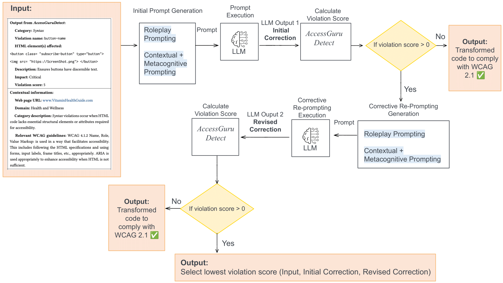

# AccessGuru: Leveraging LLMs to Detect and Correct Web Accessibility Violations in HTML Code


## Overview

**AccessGuru** is a novel system that combines large language models (LLMs) and accessibility testing tools to **automatically detect and correct web accessibility violations** in HTML code.

🔬 Contributions:

-  A taxonomy categorizing Web accessibility violations into **Syntactic**, **Semantic**, and **Layout** violations
-  A benchmark dataset of **3,500 real-world violations** across **112 types**
-  A modular pipeline:
  - `AccessGuruDetect`: Detect violations (Axe-Playwright + LLM)
  - `AccessGuruCorrect`: Generate corrections using LLM prompting strategies

<p align="center">
  
</p>

<p align="center"><b>Figure 1:</b> Overview of the AccessGuru Detection Module. Given a raw HTML document (left), the detection module applies two detectors: (1) a syntax and layout detector based on the Axe-Playwright accessibility testing engine and (2) an LLM-based semantic detector. The module outputs a set of detected accessibility violations (right).</p>

<p align="center">
  
</p>

<p align="center"><b>Figure 2:</b> Overview of AccessGuru's correction module: For each Web accessibility violation detected by AccessGuru Detection Module, the LLM is prompted to generate the corrected code. The generated code is assigned a violation score; if the violation score remains above zero, corrective re-prompting is applied to improve the response further.</p>

## 📁 Repository Structure
```
├── code/                                        # Main implementation files for syntax/layout and semantic violation correction
│
│   ├── Baselines/
│   │   ├── baselines_implementation_gpt_4.py            # Baselines implementation for Syntax and Layout Web accessibility violations correction with GPT-4. (Reproduced and adapted from original baseline methods for comparative evaluation in AccessGuru.)
│   │   ├── baselines_implementation_mistral_7b.py       # Baselines implementation for Syntax and Layout Web accessibility violations correction with Mistral-7B. (Reproduced and adapted from original baseline methods for comparative evaluation in AccessGuru.) 
│   │   ├── baselines_implementation_qwen2_7b.py         # Baselines implementation for Syntax and Layout Web accessibility violations correction with Qwen2-7B. (Reproduced and adapted from original baseline methods for comparative evaluation in AccessGuru.)
│   │   ├── semantic_implementation_gpt_4.py         # GPT-4-based baselines implementation for semantic corrections
│   │   ├── semantic_implementation_pixtral.py       # Pixtral-based baselines implementation for semantic corrections
│   │   ├── semantic_implementation_qwen_vl.py       # Qwen-VL-based baselines implementation for semantic corrections
│   │   ├── syntax_layout_implementation_gpt_4.py    # GPT-4-based baselines for syntax/layout violations
│   │   ├── syntax_layout_implementation_mistral.py  # Mistral-based baselines for syntax/layout violations
│   │   ├── syntax_layout_implementation_qwen.py     # Qwen-based baselines for syntax/layout violations
│
|   ├── AccessGuru/
|   |   ├── AccessGuruDetect/
|   |   |   ├── playwrightCode.py                        # Accessibility testing engine-based Syntax and Layout Detector for detecting syntax and layout Web accessibility violations
|   |   |   ├── accessguru_detect_syntax_layout_violation.py # Accessibility testing engine-based Syntax and Layout Detector for detecting syntax and layout Web accessibility violations
|   |   |   ├── accessguru_detect_semantic_violation.md      # LLM-based Semantic Detector Prompt for detecting semantic Web accessibility violations
|   |   ├── AccessGuruCorrect/
|   |   |   ├── semantic_metacognitive_reprompting_gpt4.py         # Ours: GPT-4 with metacognitive reprompting for semantic violations
|   |   |   ├── semantic_metacognitive_reprompting_QwenPixtral.py  # Ours: Qwen + Pixtral with metacognitive reprompting for semantic violations
|   |   |   ├── syntax_layout_metacognitive_reprompting_gpt4.py     # Ours: GPT-4 with metacognitive reprompting for syntax/layout
|   |   |   ├── syntax_layout_metacognitive_reprompting_mistral.py  # Ours: Mistral with metacognitive reprompting
|   |   |   ├── syntax_layout_metacognitive_reprompting_qwen.py     # Ours: Qwen with metacognitive reprompting
|   |   |   ├── syntax_metacognitive_implementation_GPT4.py     # GPT-4 implementation (Ablation Study: no reprompting variant)
|   |   |   ├── syntax_metacognitive_implementation_Qwen.py     # Qwen implementation (Ablation Study: no reprompting variant)
|   |   |   ├── syntax_metacognitive_implementation_mistral.py  # Mistral implementation (Ablation Study: no reprompting variant)
|   |   |   ├── accessguru_correction_mistral.py             # LLM-based correction pipeline for syntax and layout (Mistral model) (Ablation Study: no reprompting variant)
│
|   ├── Post-Processing_Evaluation/
|   |   ├── filter_extract_llm_responses.py              # Utility for filtering and extracting LLM responses to extract the generated code snippet by the LLM (post-processed with manual review).
|   |   ├── syntax_layout_evaluation.py                  # Script for computing violation score and evaluation of syntax and layout corrections (post-processed with manual review).
|   |   ├── compare_llm_corrections_humancorrections_semantic.py #Script computes the semantic similarity between LLM-generated corrections and multiple human-written corrections of semantic Web accessibility violations.
├── data/                                        # Datasets and prompt-related resources
│
│   ├── accessguru_dataset/                      # Our dataset of Web accessibility Violations
│   │   ├── accessguru_sampled_syntax_layout_dataset.csv         # Sampled subset of syntax & layout violations (Size=250)
│   │   ├── accessguru_sampled_semantic_violations.csv           # Sampled subset of semantic violations (Size=55)
│   │   ├── Original_full_data.csv                               # Full dataset before filtering/sampling (Size=3500)
│
│   ├── prompts_support/                        # Files supporting prompt construction and WCAG mapping
│   │   ├── Playwright_all_detection_tags.csv   # Tags extracted for using Axe-Playwright in rule-based detection
│   │   ├── WCAGGuidelines.csv                  # WCAG guideline references used in prompt templates
│   │   ├── mapping_dict_file.json              # Mapping violations defined in our taxonomy to corresponding WCAG that can be used for correction
│   │   ├── violation_taxonomy.csv              # Our proposed taxonomy of Web accessibility violation categories
│   │   └── violations_short_description.json   # Brief descriptions of each violation type defined in our proposed taxonomy
│   └── baseline_two_dataset.csv                # Dataset from Huang et al. (2024) used for evaluation
├── human_developer_correction_study/       # Contains survey responses and accessibility corrections from 3 Developers 
│   ├── Our_dataset_Survey.json             # Survey form shown to Developers for evaluating LLM vs. human corrections
│   └── humanCorrection_developer1.csv      # Developer 1's manual HTML corrections for semantic violations
│
├── results/                             # (To be described) Evaluation outputs and results from experiments
│
├── taxonomy_web_accessibility_violations.md     # Our Full taxonomy of accessibility violations.
├── accessguru_sampled_semantic_violations_dataset.md    # Description of the semantic dataset (You can view our sampled dataset of Semantic Web accessibility violations here, Size=55)
│
├── LICENSE.txt                         # License file (CC BY 4.0)
├── README.md                          # Project documentation
├── .gitignore                         # Git ignore configuration
```

## 🧾 Taxonomy of Web Accessibility Violations

We define a structured taxonomy to categorize and analyze web accessibility violations addressed in our study. Each violation entry includes:

- **Violation Name**  
- **Description**  
- **WCAG Guidelines** it violates  
- **Impact** on user accessibility  
- **Supplementary Information** (e.g., the context or media type)

### 📚 Violation Categories

- **Syntactic Violations**  
  These occur when HTML code lacks proper structural elements or attributes required by accessibility standards.  
  _Example:_ Missing `alt` attributes for images or improper use of `<table>` elements.  
  _(Requires HTML code expertise)_

- **Layout Violations**  
  Visual design and UI issues that hinder usability or readability, such as insufficient color contrast.  
  _(Requires familiarity with web design principles and awareness of visual accessibility)_

- **Semantic Violations**  
  Misuse or absence of meaningful content or attributes that convey context to assistive technologies.  
  _Example:_ Using placeholder text like `"image123"` for alt attributes.

> 📝 The full list of violations and their metadata is available in [taxonomy_web_accessibility_violations.md](taxonomy_web_accessibility_violations.md).


## 📊 Dataset
- 3,500 annotated HTML Web accessibility violations
- 112 distinct types
- Sourced from 448 real-world web pages across domains (health, news, e-commerce, etc.)

### Dataset Summary
We introduce a new dataset that comprehensively covers syntactic, semantic, and layout accessibility violations, reflecting real-world accessibility violations. Our dataset was collected through a structured process guided by the [WebAIM 2025 study](https://webaim.org/projects/million/), which identifies commonly visited websites with accessibility violations. To account for variation in accessibility violations across domains—e.g., government sites often use data tables, while e-commerce relies heavily on forms and images—we used GPT-4 to identify a diverse set of popular Web domains such as health, education, government, news, technology, and e-commerce, including multilingual websites. We then asked GPT-4 to suggest representative URLs from each category based on sites listed in the WebAIM 2025 study. This process yielded 448 URLs. 

We crawled each URL using Playwright and retained only those pages where `document.readyState === "complete"`.  We applied AccessGuru Detection Module (See Figure 1) to each URL to identify Web accessibility violations.  This yielded 3,500 Web accessibility violations. The dataset spans over 112 distinct violation types across all three categories. To our knowledge, it is the most comprehensive publicly available dataset of real-world Web accessibility violations to date.  

To ensure our evaluation reflects real-world Web accessibility violations, we sampled a representative subset of 305 violations from our full dataset of 3,500 instances. Sampling aligns the distribution of violation types in the subset with real-world frequencies reported in the WebAIM 2025 study. This method avoids biases caused by overrepresented violation types in large-scale crawled data but does not reflect their actual prevalence across the Web. This subset size was chosen to enable controlled and consistent comparison across LLMs and baselines. 

> 📝 You can view examples of semantic Web accessibility violations at [accessguru_sampled_semantic_violations_dataset.md](accessguru_sampled_semantic_violations_dataset.md).

### Dataset Structure 

Each row in our dataset corresponds to a unique web accessibility violation instance observed on a specific webpage. The dataset is stored as a CSV file and contains the following fields:

| Field Name               | Description                                                                 |
|--------------------------|-----------------------------------------------------------------------------|
| `id`                    | Unique identifier for the violation case                                    |
| `category`              | Type of accessibility violation (`Layout`, `Syntactic`, `Semantic`)         |
| `webURL`                | The URL of the webpage where the violation was found                        |
| `numViolations`         | Total number of violations detected on the page                             |
| `violationnumberID`     | Unique ID representing the specific violation type (e.g., image-alt)        |
| `initialImpactScore`    | Numerical severity score for the violation (e.g., 1-5)                      |
| `description`           | Description of the WCAG rule the violation violates                         |
| `affectedHTMLElement(s)`| Snippet of the HTML elements affected by violation                          |
| `additional_info`       | Any extra information needed to correct the violation (e.g., image for image-alt-not-descriptive) |
| `failureSummary`        | Summary of how the element fails accessibility compliance                   |
| `impact`                | Severity label (e.g. `Minor`, `Moderate`, `Serious`, `Critical`)            |

### 📌 Example Entry

Here is a simplified example of a dataset entry:

| Field                  | Value                                                                                  |
|------------------------|----------------------------------------------------------------------------------------|
| `id`                  | 230914312                                                                              |
| `category`            | Layout                                                                                 |
| `webURL`              | https://www.dailymail.co.uk                                                            |
| `numViolations`       | 13                                                                                     |
| `violationnumberID`   | color-contrast-enhanced                                                                |
| `initialImpactScore`  | 4                                                                                      |
| `description`         | Ensures the contrast between foreground and background colors meets WCAG 2 AAA threshold |
| `affectedHTMLElement(s)` | `<span class="">1AM</span>`, `<span class="is-exclusive">EXCLUSIVE</span>`       |
| `additional_info`     | foreground: `#ffffff`, background: `#f03649`                                           |
| `failureSummary`      | Poor color contrast makes text unreadable for users with vision impairments            |
| `impact`              | Serious                                                                                |

👉 You can explore the full dataset [here](data/accessguru_dataset).


## 📦 Baselines 
Reproducible baseline implementations:

- **Zero-shot prompting**

Delnevo, Giovanni, Manuel Andruccioli, and Silvia Mirri. "On the interaction with large language models for web accessibility: Implications and challenges." 2024 IEEE 21st Consumer Communications & Networking Conference (CCNC). IEEE, 2024.

- **Contextual prompting**

Othman, Achraf, Amira Dhouib, and Aljazi Nasser Al Jabor. "Fostering websites accessibility: A case study on the use of the Large Language Models ChatGPT for automatic remediation." Proceedings of the 16th international conference on pervasive technologies related to assistive environments. 2023.

- **ReAct prompting**

Huang, Calista, et al. "Access: Prompt engineering for automated web accessibility violation corrections." arXiv preprint arXiv:2401.16450 (2024).

## 👩‍💻 Human Evaluation
This repository includes a developer study to compare LLM-generated accessibility corrections with human-written ones. We evaluated 55 semantic violations using:
- Manual expert annotations based on WCAG 2.1
- Sentence-BERT semantic similarity with developer-generated fixes

📋 You can contribute to our ongoing evaluation study by participating in a short survey and reviewing a small set of HTML accessibility corrections. 

Participate in the Evaluation Survey
(https://surveyjs.io/published?id=c2ebd794-0b9d-4af2-a4ab-79c5ddb6c509)

Your feedback will support future benchmarking and the design of more effective accessibility correction systems.


## 🧪 Results

| Method                          | Model          | Avg. Violation Score Decrease (Our Dataset, Size=250) | # Corrected Violations (Our Dataset, Size=250) | Avg. Violation Score Decrease (Huang et al. Dataset, Size=171) | # Corrected Violations (Huang et al. Dataset, Size=171) |
| ------------------------------- | -------------- | ------------------- | -------------- | --------------------------- | ---------------------- |
| Contextual Prompting            | GPT-4          | 0.46                | 123            | 0.42                        | 86                     |
| ReAct Prompting                 | GPT-4          | 0.50                | 141            | 0.48                        | 91                     |
| Zero-shot Prompting             | GPT-4          | 0.19                | 43             | 0.12                        | 19                     |
| **AccessGuru (w/o reprompting)** | GPT-4          | *0.72*              | *184*          | *0.67*                      | *119*                  |
| **AccessGuru (Ours)**           | **GPT-4**      | **0.84**            | **204**        | **0.83**                    | **141**                |
| Contextual Prompting            | Mistral-7B     | 0.12                | 44             | 0.27                        | 62                     |
| ReAct Prompting                 | Mistral-7B     | 0.13                | 45             | 0.26                        | 48                     |
| Zero-shot Prompting             | Mistral-7B     | 0.05                | 10             | 0.002                       | 2                      |
| **AccessGuru (w/o reprompting)** | Mistral-7B     | *0.50*              | *162*          | *0.51*                      | *110*                  |
| **AccessGuru (Ours)**           | **Mistral-7B** | **0.82**            | **200**        | **0.79**                    | **147**                |
| Contextual Prompting            | Qwen2.5        | 0.41                | 121            | 0.39                        | 77                     |
| ReAct Prompting                 | Qwen2.5        | 0.44                | 130            | 0.37                        | 71                     |
| Zero-shot Prompting             | Qwen2.5        | 0.14                | 54             | 0.19                        | 49                     |
| **AccessGuru (w/o reprompting)** | Qwen2.5        | *0.49*              | *153*          | *0.52*                      | *103*                  |
| **AccessGuru (Ours)**           | **Qwen2.5**    | **0.74**            | **183**        | **0.75**                    | **126**                |

<p align="center"><b>Table 1:</b> Comparison of the decrease in violation score and the number of corrected accessibility violations for syntax & layout violations on our dataset and the dataset from Huang et al. Dataset</p>

| Method                          | Model       | Avg. Violation Score Decrease | # Corrected Violations |
| ------------------------------- | ----------- | ----------------------------- | ---------------------- |
| Contextual Prompting            | GPT-4       | 0.82                          | 44                     |
| ReAct Prompting                 | GPT-4       | 0.87                          | 48                     |
| Zero-shot Prompting             | GPT-4       | 0.33                          | 18                     |
| **AccessGuru (w/o reprompting)** | GPT-4       | *0.92*                        | *51*                   |
| **AccessGuru (Ours)**           | **GPT-4**   | **0.96**                      | **53**                 |
| Contextual Prompting            | Pixtral     | 0.75                          | 41                     |
| ReAct Prompting                 | Pixtral     | 0.81                          | 44                     |
| Zero-shot Prompting             | Pixtral     | 0.54                          | 29                     |
| **AccessGuru (w/o reprompting)** | Pixtral     | *0.83*                        | *46*                   |
| **AccessGuru (Ours)**           | **Pixtral** | **0.92**                      | **51**                 |
| Contextual Prompting            | Qwen-VL     | 0.60                          | 32                     |
| ReAct Prompting                 | Qwen-VL     | 0.37                          | 20                     |
| Zero-shot Prompting             | Qwen-VL     | 0.18                          | 8                      |
| **AccessGuru (w/o reprompting)** | Qwen-VL     | *0.69*                        | *37*                   |
| **AccessGuru (Ours)**           | **Qwen-VL** | **0.75**                      | **41**                 |

<p align="center"><b>Table 2:</b> Comparison of average violation score decrease and number of corrected semantic accessibility violations on our dataset (Size = 55).</p>

## 📬 Contact

For inquiries, feel free to contact:
nadeen.fathallah@ki.uni-stuttgart.de


## 📜 License

[](https://creativecommons.org/licenses/by/4.0/)  
The AccessGuru dataset is licensed under a [Creative Commons Attribution 4.0 International License](https://creativecommons.org/licenses/by/4.0/).

 Code under this repo is licensed under a MIT License.


## 📄 Citation

If you find this work useful, please consider citing our paper:

```
@inproceedings{fathallah2025accessguru,
  title={AccessGuru: Leveraging LLMs to Detect and Correct Web Accessibility Violations in HTML Code},
  author={Fathallah, Nadeen and Hernández, Daniel and Staab, Steffen},
  booktitle={Proceedings of the 27th International ACM SIGACCESS Conference on Computers and Accessibility},
  year={2025},
  publisher={ACM}
}

